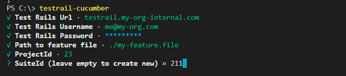
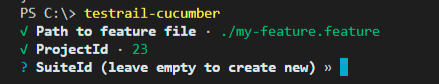

# Testrail Cucumber Uploader

Converts Gherkin `.feature` files into test cases on TestRail.
Only works on Projects with multiple suites.

The `Feature` is added as a section, with `Rule`s making a subsection. Free form
descriptions will be added as descriptions for their relevant group.

## Installing & Running

Install:

```sh
$ npm i -g @autometa/testrail-cucumber
```

Run:

```sh
$ testrail-cucumber
```

Clear cached configs (username, password)

```sh
$ testrail-cucumber --clearAll
```

Run for feature file

```sh
$ testrail-cucumber ./path/to/file
```



URL and user details are stored between sessions.


**Note** IDs should be the numeric id, not the string id - e.g. `123` not `S123` or `P123`

## Output

For the following `.feature` file

```gherkin

Feature: My Sample Feature
    This is a description of the Feature Under Test

    Rule: If there is a Rule, then it will become a subsection
        This is a description of that rule

        Scenario: A Chicken, A Donkey and a Priest Walk Into A Bar
            This is a test description

            Given a step with a table:
                | user    | age |
                | john    | 5   |
                | tabatha | 12  |
            When something happens
            Then a validation can be done
```

The following TestRail suite will be created:

