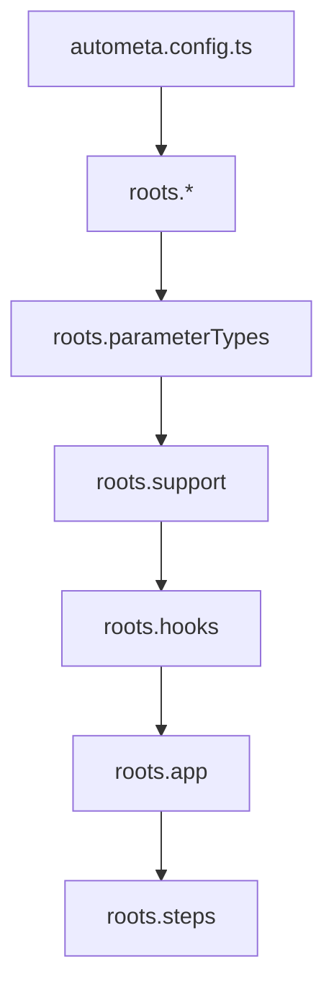
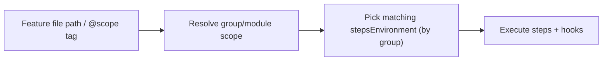

# Step discovery & module loading

Most “it works / it doesn’t work” issues in Autometa come down to *what got imported* (and in what order). This page explains how the runtime discovers your steps, parameter types, support modules, and (in monorepos) which step environment applies to a given feature.

## Root module load order (CLI / standalone)

When you run via `autometa run --standalone`, the CLI loads modules in a predictable order:



This is why splitting “polyfills / setup” from “step registration” is useful: it lets you ensure types, globals, and listeners exist before any steps are registered.

## How steps are discovered

Autometa expects your step entrypoint modules to export a `stepsEnvironment` (built via `CucumberRunner.builder().steps()`), and for your step modules to be imported for side effects.

### Function steps (register on import)

With function steps, importing the module is what registers phrases:

- `Given("...", handler)` runs at import time.
- This is why `roots.steps` must include either the folder containing your step modules, or a single file that imports them.

### Decorator steps (metadata + discovery)

With decorator steps, classes/methods are decorated, and the runner collects metadata:

- You decorate methods (`@Given("...")`) instead of calling `Given("...")` directly.
- The step modules still need to be imported, so the classes are evaluated and metadata exists.
- Your `stepsEnvironment` creation is still the “anchor” export that runners and the CLI discover.

## Selecting a step environment (groups/modules)

In a flat suite you usually have a single `stepsEnvironment`.

In a group-based suite (monorepo style), you can export multiple environments—one per app/API—by using `CucumberRunner.builder().group("<group>")` (or `.derivable().group(...)`).



For the concrete layout and config model, see [Getting Started → Monorepos](../getting-started/monorepos.md) and [Reference → CLI](../reference/cli.md).

### Overriding scope with tags

When `modules.stepScoping` is enabled, feature files can explicitly select scope using a tag:

```
@scope(backoffice:reports)
Feature: Reports
```

Supported forms:

- `@scope(group)` to assign the feature to a group (useful for hoisted features)
- `@scope(group:module/submodule)` for a specific module path

This is especially useful for “hoisted” features that live outside any specific group root.

Hoisted scoping behavior is configurable via `modules.hoistedFeatures.scope`:

- `"tag"` (default): hoisted features require `@scope(...)`
- `"directory"`: infer scope from the feature’s directory under `roots.features`

Note: `@scope(<group>)` does not intentionally downgrade a feature that already lives under a module directory; path-based module inference still applies.
