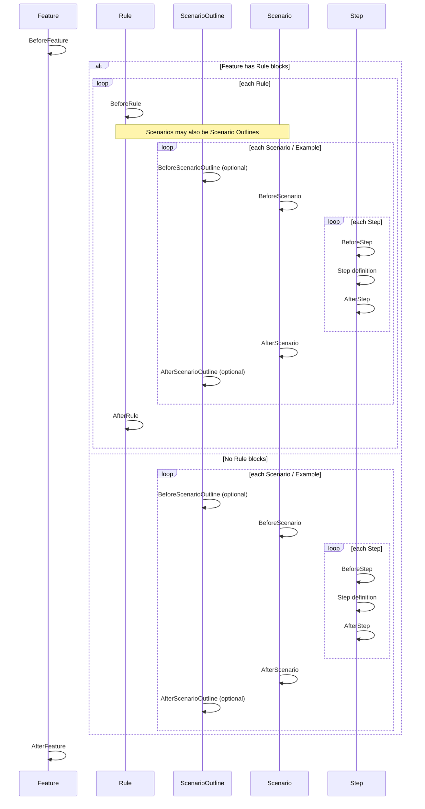

# Hooks & Lifecycle

Autometa provides a rich set of hooks to manage the lifecycle of your tests. These hooks allow you to execute code at specific points in the test execution process.

## Execution Order

This diagram shows the execution order of Autometa hooks during a single feature run:



Suite-level setup/teardown (run once per test process) is intentionally handled by your **host runner** (Vitest/Jest/Playwright) or by modules you load via `roots.support` / `roots.hooks` (see below).

## Hook Ordering

Hook ordering is determined by:

1. `order` (lower runs first for `Before*`, higher runs first for `After*`)
2. scope depth (more nested hooks run first for `Before*`, and last for `After*`)

By default, hooks have an order of `5`.

```ts
BeforeScenario("start a stub server", ({ world }) => {
  void world;
}).order(1);
```

You can also set `order` via the options object:

```ts
BeforeScenario(
  "start a stub server",
  ({ world }) => {
    void world;
  },
  { order: 1 }
);
```

## Worlds Per Scope

Autometa always creates a fresh **scenario world** per scenario. It can *also* create “persistent” worlds for higher scopes, but only when needed:

- **Feature world**: created when you register `BeforeFeature`/`AfterFeature` hooks.
- **Rule world**: created when you register `BeforeRule`/`AfterRule` hooks.
- **Scenario outline world**: created when you register `BeforeScenarioOutline`/`AfterScenarioOutline` hooks.

When a persistent world exists, it becomes the `parent` world for the next nested scope (feature → rule → scenario outline → scenario).

This means:

- Feature hooks run with a **feature world**
- Rule hooks run with a **rule world**
- Scenario outline hooks run with a **scenario outline world**
- Scenario hooks + step definitions run with a **scenario world**

If you never register feature/rule/outline hooks, those worlds are never created—so scenarios run with just the scenario world.

```mermaid
flowchart TD
  FeatureWorld["Feature world (optional)"] --> RuleWorld["Rule world (optional)"]
  RuleWorld --> OutlineWorld["Scenario outline world (optional)"]
  OutlineWorld --> ScenarioWorld["Scenario world (always)"]
  FeatureWorld -. context.parent .-> RuleWorld
  RuleWorld -. context.parent .-> OutlineWorld
  OutlineWorld -. context.parent .-> ScenarioWorld
```

### Accessing parent worlds from a scenario

Autometa does not automatically add typed `world.feature` / `world.rule` properties. Instead:

- Your `.withWorld(...)` factory receives `context.parent` when a parent world exists.
- A non-enumerable `world.ancestors` array is attached, containing the parent world and its parents (nearest-first).

If you want selected values copied from the parent world into the child world, opt-in via `WORLD_INHERIT_KEYS`:

```ts
import { WORLD_INHERIT_KEYS } from "@autometa/runner";

export const worldDefaults = {
  baseUrl: "",
  [WORLD_INHERIT_KEYS]: ["baseUrl"] as const,
};
```

Because persistent worlds can be shared across many scenarios (including concurrent runs), treat them as read-only unless you intentionally want shared state.

## Hook Arguments

All hooks receive an object containing the `World` and other context information.

```ts
BeforeScenario(({ world, scope, metadata }) => {
  console.log(`Starting scenario: ${scope.name}`);
});
```

- **`world`**: The current scenario's world instance.
- **`scope`**: Information about the current scope (feature, scenario, etc.).
- **`metadata`**: Additional metadata about the hook execution.

## Registering Hooks

Hooks come from your exported `stepsEnvironment` (typically from `src/step-definitions.ts`):

```ts
// src/step-definitions.ts
export const stepsEnvironment = runner.steps();

export const {
  BeforeFeature,
  AfterFeature,
  BeforeRule,
  AfterRule,
  BeforeScenarioOutline,
  AfterScenarioOutline,
  BeforeScenario,
  AfterScenario,
  BeforeStep,
  AfterStep,
} = stepsEnvironment;

BeforeScenario(({ world }) => {
  world.db.connect();
});

AfterScenario(({ world }) => {
  world.db.disconnect();
});
```

## Hook Tags (Metadata)

Hooks can be tagged for metadata/debugging purposes.

```ts
BeforeScenario(({ world }) => {
  world.db.seed();
}, { tags: ["@database"] });
```

Scenario selection is controlled via `test.tagFilter` in `autometa.config.ts`.

## Global Hooks

Autometa does not provide a runner-agnostic `BeforeAll`/`AfterAll` hook surface from `stepsEnvironment`. For “run once” setup, use one of these patterns:

- **Host runner setup**: use the runner’s native mechanism (Vitest setup files, Jest `globalSetup`, Playwright `globalSetup`) when you need true once-per-process semantics.
- **Root modules**: for side-effect imports that must happen before steps, put them in `roots.support` (or `roots.hooks`) so the CLI/loader imports them before `roots.steps`.

```ts title="autometa.config.ts (side-effect module)"
import { defineConfig } from "@autometa/config";

export default defineConfig({
  default: {
    roots: {
      support: ["./src/support/setup.ts"],
      steps: ["./src/steps", "./src/step-definitions.ts"],
    },
  },
});
```
