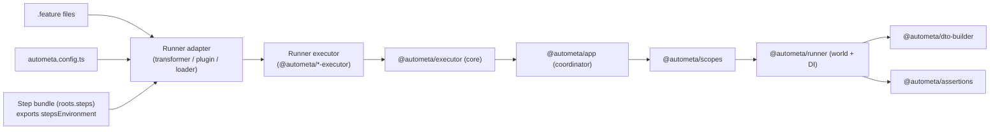

# Runtime architecture

Autometa v1 separates authoring concerns (steps, phrases, DTO builders) from runtime concerns (executors, reporters, and fixture scopes). The released runtime is composed of the following layers:

- **Umbrella entrypoint (`@autometa/core`)** – ergonomic re-exports for user-facing APIs via subpaths (`/runner`, `/config`, `/assert`, `/http`, ...).
- **Coordinator (`@autometa/app`)** – resolves feature intents, bootstraps scopes, and orchestrates providers.
- **Executor core (`@autometa/executor`)** – shared runtime used by all runner-specific executors.
- **Executors (`@autometa/*-executor`)** – bind to a specific runner (Jest, Vitest, or Playwright) and drive Autometa’s lifecycle.
- **Runner adapters** – jest transformer, vitest plugin, and Playwright loader map `.feature` files into the host runner.
- **Scopes & world (`@autometa/scopes`, `@autometa/runner`)** – manage dependency injection, memoized fixtures, and hook ordering.
- **DTO builder (`@autometa/dto-builder`)** – optional but common for constructing deterministic fixtures before each scenario.
- **Assertion plugins (`@autometa/assertions`)** – shape `ensure(...)` facades that expose domain-specific verifiers bound to the active world.

## Lifecycle at a glance

1. **Feature discovery** – the runner adapter feeds `.feature` files to the coordinator along with tags and location data.
2. **World construction** – scopes register providers (HTTP clients, data builders, db connections), producing a world per scenario.
3. **Executor orchestration** – the executor translates host-runner lifecycle signals into Autometa lifecycle events (feature/scenario/step/hook).
4. **Step execution** – phrases resolve to step handlers; builders and assertion factories pull from the active world to stay deterministic.
5. **Reporting** – results flow back through the coordinator so reporters and formatters can emit JSON, hierarchical logs, or custom streams.

## Key artifacts you own

- `autometa.config.ts` describes what to load (`roots.*`), how to run (`runner`), and how to filter (`test.tagFilter`, optional group/module selection).
- Your step entrypoint exports `stepsEnvironment` (created via `CucumberRunner.builder().steps()`), which is how the runtime discovers `Given/When/Then`, hooks, and `ensure(...)`.
- Your world factory (`.withWorld(...)`) is the single place to define scenario state; group-based suites can extend it per app/API.

## Coordinating runners and plugins

- The Jest stack relies on `@autometa/jest-transformer` to compile `.feature` documents, then delegates execution to `@autometa/jest-executor`.
- Vitest hosts the runtime through `@autometa/vitest-plugins`, which registers a custom suite per `.feature` document and injects hooks via the plugin API.
- Playwright consumes `.spec.ts` files emitted by `@autometa/playwright-loader` and drives them via `@autometa/playwright-executor`.

Across all runners, the coordinator injects the same world builder, DTO factories, and assertion plugins. That parity is what enables the examples to share step definitions even though the host runner changes.

## CLI orchestrator & config discovery

The CLI (`@autometa/cli`) reads your config and picks an execution mode:

- Detects native runners (Vitest/Jest/Playwright) by checking for their config files; delegates when present.
- Falls back to a standalone runtime when no native runner is available or when `--standalone` is set.
- Compiles TypeScript configs on the fly into a cache dir (override via `AUTOMETA_CACHE_DIR` or `AUTOMETA_HOME`).
- Locates config by searching upward for `autometa.config.*` or `autometa.<name>.config.*` (use `--config` to override).

## Next: discovery details

If you are debugging “why didn’t my steps load?”, see [Step discovery & module loading](discovery).
