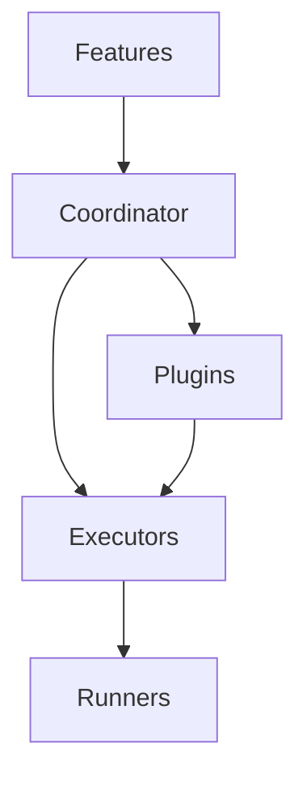

# Runtime architecture

Autometa v1 decouples authoring concerns (steps, phrases, DTO builders) from runtime concerns (executors, reporters, and fixture scopes). The runtime is composed of:

- **Coordinator** – resolves feature intents, bootstraps scopes, and orchestrates providers.
- **Executor** – binds to a specific runner (`Vitest`, `Jest`, or `Playwright`) and drives test lifecycle hooks.
- **Plugins** – extend runner capabilities (e.g., cucumber markdown loader, binding decorators) without leaking implementation details.

Expect more diagrams and package-to-package callouts as the implementation hardens.
