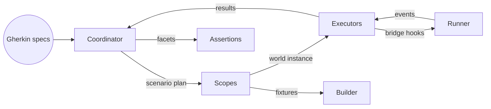

# Runtime architecture

Autometa v1 separates authoring concerns (steps, phrases, DTO builders) from runtime concerns (executors, reporters, and fixture scopes). The released runtime is composed of the following layers:

- **Coordinator (`@autometa/app`)** – resolves feature intents, bootstraps scopes, and orchestrates providers.
- **Executors (`@autometa/*-executor`)** – bind to a specific runner (Jest, Vitest, or Playwright) and drive lifecycle hooks.
- **Runner adapters** – jest transformer, vitest plugin, and Playwright loader map `.feature` files into the host runner.
- **Scopes & world (`@autometa/scopes`, `@autometa/runner`)** – manage dependency injection, memoized fixtures, and hook ordering.
- **DTO builder (`@autometa/dto-builder`)** – optional but common for constructing deterministic fixtures before each scenario.
- **Assertion plugins (`@autometa/assertions`)** – shape `ensure(...)` facades that expose domain-specific verifiers bound to the active world.

## Lifecycle at a glance

1. **Feature discovery** – the runner adapter feeds `.feature` files to the coordinator along with tags and location data.
2. **World construction** – scopes register providers (HTTP clients, data builders, db connections), producing a world per scenario.
3. **Executor orchestration** – the executor listens to runner hooks (`beforeAll`, `test`, `afterAll`) and translates them into Autometa lifecycle events.
4. **Step execution** – phrases resolve to decorated step handlers. Builders and assertion factories pull from the world to stay deterministic.
5. **Reporting** – results flow back through the coordinator so reporters and formatters can emit JSON, hierarchical logs, or custom streams.

## Coordinating runners and plugins

- The Jest stack relies on `@autometa/jest-transformer` to compile `.feature` documents, then delegates execution to `@autometa/jest-executor`.
- Vitest hosts the runtime through `@autometa/vitest-plugins`, which registers a custom suite per `.feature` document and injects hooks via the plugin API.
- Playwright consumes `.spec.ts` files emitted by `@autometa/playwright-loader` and drives them via `@autometa/playwright-executor`.

Across all runners, the coordinator injects the same world builder, DTO factories, and assertion plugins. That parity is what enables the examples to share step definitions even though the host runner changes.
